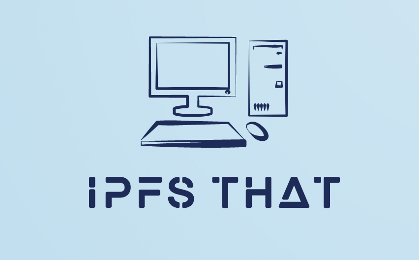

# ipfs-that



A utility that bring the web to IPFS!

## Overview
IPFS That provides a simple interface to pull web pages from the internet and push them to IPFS. 

Under the hood, it uses `wget` to fetch the specified web page and all associated assets. This data is then published to IPFS. The UI then provides a link to the content which can shared and accessed from an IPFS-connected context.

## Running Locally

The necessary components include:
- An IPFS node
- MongoDB instance
- API server
- Frontend

To start an IPFS node and MongoDB instance run:
```bash
docker-compose up
```

You can run the API server with:
```bash
go run main.go
```

The UI can be started with:
```bash
cd ui
npm i
npm start
```

The UI should open in your default browser. Alternatively, go to `http://localhost:3000`.